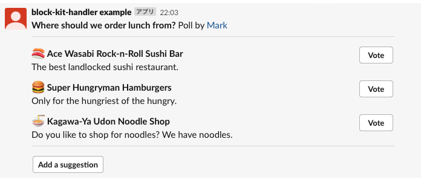
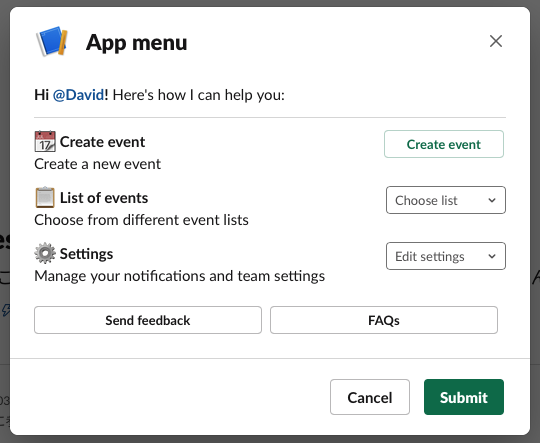
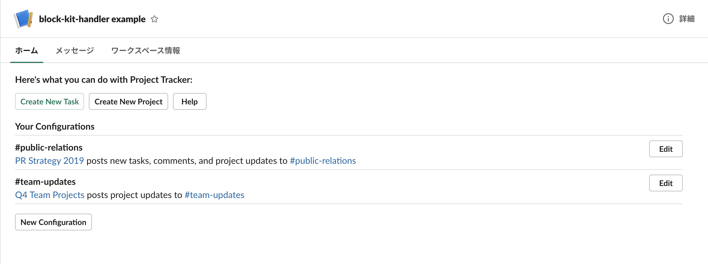

# block-kit-handler

Block Kit is a very powerful UI framework that provides you to flexibly construct messages, modals and HomeTabs sent or created from Slack Apps.  
However, since the UI is defined by JSON, it is a little difficult to handle in a program.  
block-kit-handler lets you programmatically handle Block Kit with less code and in an easier way.

## Installation
```sh
npm install block-kit-handler
```

## Usage
I have Github project that shows how to use block-kit-handler.  
For details, please refer to [the project](https://github.com/saito-ya/block-kit-handler-examples).

### message
```typescript
import { Block } from '@slack/types';
import { actions, section, button, divider, mrkdwnText, plainText } from 'block-kit-handler';

app.command("/message", async ({ ack, payload, context }) => {
    await ack();

    // declare blocks for message
    const blocks: Block[] = [
        section({ text: mrkdwnText('*Where should we order lunch from?* Poll by <fakeLink.toUser.com|Mark>')}),
        divider(),
        section({
            text: mrkdwnText(':sushi: *Ace Wasabi Rock-n-Roll Sushi Bar*\nThe best landlocked sushi restaurant.'),
            accessory: button(plainText('Vote'), 'vote-a', { value: 'click_me_123'})
        }),
        section({
            text: mrkdwnText(':hamburger: *Super Hungryman Hamburgers*\nOnly for the hungriest of the hungry.'),
            accessory: button(plainText('Vote'), 'vote-b', { value: 'click_me_123'})
        }),
        section({
            text: mrkdwnText(':ramen: *Kagawa-Ya Udon Noodle Shop*\nDo you like to shop for noodles? We have noodles.'),
            accessory: button(plainText('Vote'), 'vote-c', { value: 'click_me_123'})
        }),
        divider(),
        actions([ button(plainText('Add a suggestion'), 'add-suggestion', { value: 'click_me_123' })])
    ];

    // post message
    await app.client.chat.postMessage({
        token: context.botToken,
        channel: payload.channel_id,
        text: 'message sample',
        blocks: blocks
    });
});
```



If you use the raw JSON to create the same message, you'll have to write many more lines.  
See [this](https://app.slack.com/block-kit-builder/T1CC0HZDJ#%7B%22blocks%22:%5B%7B%22type%22:%22section%22,%22text%22:%7B%22type%22:%22mrkdwn%22,%22text%22:%22*Where%20should%20we%20order%20lunch%20from?*%20Poll%20by%20%3CfakeLink.toUser.com%7CMark%3E%22%7D%7D,%7B%22type%22:%22divider%22%7D,%7B%22type%22:%22section%22,%22text%22:%7B%22type%22:%22mrkdwn%22,%22text%22:%22:sushi:%20*Ace%20Wasabi%20Rock-n-Roll%20Sushi%20Bar*%5CnThe%20best%20landlocked%20sushi%20restaurant.%22%7D,%22accessory%22:%7B%22type%22:%22button%22,%22text%22:%7B%22type%22:%22plain_text%22,%22emoji%22:true,%22text%22:%22Vote%22%7D,%22value%22:%22click_me_123%22%7D%7D,%7B%22type%22:%22section%22,%22text%22:%7B%22type%22:%22mrkdwn%22,%22text%22:%22:hamburger:%20*Super%20Hungryman%20Hamburgers*%5CnOnly%20for%20the%20hungriest%20of%20the%20hungry.%22%7D,%22accessory%22:%7B%22type%22:%22button%22,%22text%22:%7B%22type%22:%22plain_text%22,%22emoji%22:true,%22text%22:%22Vote%22%7D,%22value%22:%22click_me_123%22%7D%7D,%7B%22type%22:%22section%22,%22text%22:%7B%22type%22:%22mrkdwn%22,%22text%22:%22:ramen:%20*Kagawa-Ya%20Udon%20Noodle%20Shop*%5CnDo%20you%20like%20to%20shop%20for%20noodles?%20We%20have%20noodles.%22%7D,%22accessory%22:%7B%22type%22:%22button%22,%22text%22:%7B%22type%22:%22plain_text%22,%22emoji%22:true,%22text%22:%22Vote%22%7D,%22value%22:%22click_me_123%22%7D%7D,%7B%22type%22:%22divider%22%7D,%7B%22type%22:%22actions%22,%22elements%22:%5B%7B%22type%22:%22button%22,%22text%22:%7B%22type%22:%22plain_text%22,%22emoji%22:true,%22text%22:%22Add%20a%20suggestion%22%7D,%22value%22:%22click_me_123%22%7D%5D%7D%5D%7D).

### modal
```typescript
import { Block } from '@slack/types';
import { Modal, actions, section, button, divider, staticSelect, option, mrkdwnText, plainText } from 'block-kit-handler';

app.command("/modal", async ({ ack, payload, context }) => {
    await ack();

    // declare blocks for modal
    const blocks: Block[] = [
        section({ text: mrkdwnText('*Hi <fakelink.toUser.com|@David>!* Here\'s how I can help you:')}),
        divider(),
        section({
            text: mrkdwnText(':calendar: *Create event*\nCreate a new event'),
            accessory: button(plainText('Create event'), 'create', { value: 'click_me_123', style: 'primary' })
        }),
        section({
            text: mrkdwnText(':clipboard: *List of events*\nChoose from different event lists'),
            accessory: staticSelect('chose-list', plainText('Choose list'), [
                option(plainText('My events'), 'value-0'),
                option(plainText('All events'), 'value-1'),
                option(plainText('Event invites'), 'value-2')
            ])
        }),
        section({
            text: mrkdwnText(':gear: *Settings*\nManage your notifications and team settings'),
            accessory: staticSelect('edit-settings', plainText('Edit settings'), [
                option(plainText('Notifications'), 'value-0'),
                option(plainText('Team settings'), 'value-1')
            ])
        }),
        actions([
            button(plainText('Send feedback'), 'send-feedback', { value: 'click_me_123' }),
            button(plainText('FAQs'), 'faqs', { value: 'click_me_123' })
        ])
    ];

    // build modal
    const modal = new Modal(plainText('App menu'), blocks, { close: plainText('Cancel'), submit: plainText('Submit')});

    // open modal
    await app.client.views.open({
        token: context.botToken,
        trigger_id: payload.trigger_id,
        view: modal.getView()
    });
});
```



 JSON for the same modal is [Here](https://app.slack.com/block-kit-builder/T1CC0HZDJ#%7B%22type%22:%22modal%22,%22submit%22:%7B%22type%22:%22plain_text%22,%22text%22:%22Submit%22,%22emoji%22:true%7D,%22close%22:%7B%22type%22:%22plain_text%22,%22text%22:%22Cancel%22,%22emoji%22:true%7D,%22title%22:%7B%22type%22:%22plain_text%22,%22text%22:%22App%20menu%22,%22emoji%22:true%7D,%22blocks%22:%5B%7B%22type%22:%22section%22,%22text%22:%7B%22type%22:%22mrkdwn%22,%22text%22:%22*Hi%20%3Cfakelink.toUser.com%7C@David%3E!*%20Here's%20how%20I%20can%20help%20you:%22%7D%7D,%7B%22type%22:%22divider%22%7D,%7B%22type%22:%22section%22,%22text%22:%7B%22type%22:%22mrkdwn%22,%22text%22:%22:calendar:%20*Create%20event*%5CnCreate%20a%20new%20event%22%7D,%22accessory%22:%7B%22type%22:%22button%22,%22text%22:%7B%22type%22:%22plain_text%22,%22text%22:%22Create%20event%22,%22emoji%22:true%7D,%22style%22:%22primary%22,%22value%22:%22click_me_123%22%7D%7D,%7B%22type%22:%22section%22,%22text%22:%7B%22type%22:%22mrkdwn%22,%22text%22:%22:clipboard:%20*List%20of%20events*%5CnChoose%20from%20different%20event%20lists%22%7D,%22accessory%22:%7B%22type%22:%22static_select%22,%22placeholder%22:%7B%22type%22:%22plain_text%22,%22text%22:%22Choose%20list%22,%22emoji%22:true%7D,%22options%22:%5B%7B%22text%22:%7B%22type%22:%22plain_text%22,%22text%22:%22My%20events%22,%22emoji%22:true%7D,%22value%22:%22value-0%22%7D,%7B%22text%22:%7B%22type%22:%22plain_text%22,%22text%22:%22All%20events%22,%22emoji%22:true%7D,%22value%22:%22value-1%22%7D,%7B%22text%22:%7B%22type%22:%22plain_text%22,%22text%22:%22Event%20invites%22,%22emoji%22:true%7D,%22value%22:%22value-1%22%7D%5D%7D%7D,%7B%22type%22:%22section%22,%22text%22:%7B%22type%22:%22mrkdwn%22,%22text%22:%22:gear:%20*Settings*%5CnManage%20your%20notifications%20and%20team%20settings%22%7D,%22accessory%22:%7B%22type%22:%22static_select%22,%22placeholder%22:%7B%22type%22:%22plain_text%22,%22text%22:%22Edit%20settings%22,%22emoji%22:true%7D,%22options%22:%5B%7B%22text%22:%7B%22type%22:%22plain_text%22,%22text%22:%22Notifications%22,%22emoji%22:true%7D,%22value%22:%22value-0%22%7D,%7B%22text%22:%7B%22type%22:%22plain_text%22,%22text%22:%22Team%20settings%22,%22emoji%22:true%7D,%22value%22:%22value-1%22%7D%5D%7D%7D,%7B%22type%22:%22actions%22,%22elements%22:%5B%7B%22type%22:%22button%22,%22text%22:%7B%22type%22:%22plain_text%22,%22text%22:%22Send%20feedback%22,%22emoji%22:true%7D,%22value%22:%22click_me_123%22%7D,%7B%22type%22:%22button%22,%22text%22:%7B%22type%22:%22plain_text%22,%22text%22:%22FAQs%22,%22emoji%22:true%7D,%22value%22:%22click_me_123%22%7D%5D%7D%5D%7D).


### home tab
```typescript
import { Block } from '@slack/types';
import { HomeTab, actions, section, button, divider, staticSelect, option, mrkdwnText, plainText } from 'block-kit-handler';

app.event('app_home_opened', async({ context, body }) => {
    // declare blocks for home tab
    const blocks: Block[] = [
        section({ text: mrkdwnText('*Here\'s what you can do with Project Tracker:*')}),
        actions([
            button(plainText('Create New Task'), 'create-new-task', { value: 'click_me_123', style: 'primary' }),
            button(plainText('Create New Project'), 'create-new-project', { value: 'click_me_123' }),
            button(plainText('Help'), 'help', { value: 'click_me_123' })
        ]),
        section({ text: mrkdwnText('*Your Configurations*')}),
        divider(),
        section({
            text: mrkdwnText('*#public-relations*\n<fakelink.toUrl.com|PR Strategy 2019> posts new tasks, comments, and project updates to <fakelink.toChannel.com|#public-relations>'),
            accessory: button(plainText('Edit'), 'edit-1', { value: 'public-relations' })
        }),
        divider(),
        section({
            text: mrkdwnText('*#team-updates*\n<fakelink.toUrl.com|Q4 Team Projects> posts project updates to <fakelink.toChannel.com|#team-updates>'),
            accessory: button(plainText('Edit'), 'edit-2', { value: 'public-relations' })
        }),
        divider(),
        actions([
            button(plainText('New Configuration'), 'new-configuration', { value: 'new_configuration' })
        ])
    ];

    // build home tab
    const homeTab = new HomeTab(blocks);

    // publish home tab
    await app.client.views.publish({
        token: context.botToken,
        user_id: body.user_id,
        view: homeTab.getView()
    });
});
```



 JSON for the same home tab is [here](https://app.slack.com/block-kit-builder/T1CC0HZDJ#%7B%22type%22:%22home%22,%22blocks%22:%5B%7B%22type%22:%22section%22,%22text%22:%7B%22type%22:%22mrkdwn%22,%22text%22:%22*Here's%20what%20you%20can%20do%20with%20Project%20Tracker:*%22%7D%7D,%7B%22type%22:%22actions%22,%22elements%22:%5B%7B%22type%22:%22button%22,%22text%22:%7B%22type%22:%22plain_text%22,%22text%22:%22Create%20New%20Task%22,%22emoji%22:true%7D,%22style%22:%22primary%22,%22value%22:%22create_task%22%7D,%7B%22type%22:%22button%22,%22text%22:%7B%22type%22:%22plain_text%22,%22text%22:%22Create%20New%20Project%22,%22emoji%22:true%7D,%22value%22:%22create_project%22%7D,%7B%22type%22:%22button%22,%22text%22:%7B%22type%22:%22plain_text%22,%22text%22:%22Help%22,%22emoji%22:true%7D,%22value%22:%22help%22%7D%5D%7D,%7B%22type%22:%22section%22,%22text%22:%7B%22type%22:%22mrkdwn%22,%22text%22:%22*Your%20Configurations*%22%7D%7D,%7B%22type%22:%22divider%22%7D,%7B%22type%22:%22section%22,%22text%22:%7B%22type%22:%22mrkdwn%22,%22text%22:%22*#public-relations*%5Cn%3Cfakelink.toUrl.com%7CPR%20Strategy%202019%3E%20posts%20new%20tasks,%20comments,%20and%20project%20updates%20to%20%3Cfakelink.toChannel.com%7C#public-relations%3E%22%7D,%22accessory%22:%7B%22type%22:%22button%22,%22text%22:%7B%22type%22:%22plain_text%22,%22text%22:%22Edit%22,%22emoji%22:true%7D,%22value%22:%22public-relations%22%7D%7D,%7B%22type%22:%22divider%22%7D,%7B%22type%22:%22section%22,%22text%22:%7B%22type%22:%22mrkdwn%22,%22text%22:%22*#team-updates*%5Cn%3Cfakelink.toUrl.com%7CQ4%20Team%20Projects%3E%20posts%20project%20updates%20to%20%3Cfakelink.toChannel.com%7C#team-updates%3E%22%7D,%22accessory%22:%7B%22type%22:%22button%22,%22text%22:%7B%22type%22:%22plain_text%22,%22text%22:%22Edit%22,%22emoji%22:true%7D,%22value%22:%22public-relations%22%7D%7D,%7B%22type%22:%22divider%22%7D,%7B%22type%22:%22actions%22,%22elements%22:%5B%7B%22type%22:%22button%22,%22text%22:%7B%22type%22:%22plain_text%22,%22text%22:%22New%20Configuration%22,%22emoji%22:true%7D,%22value%22:%22new_configuration%22%7D%5D%7D%5D%7D).

## Supported Components
### Surfaces
| Components | Supported | Link |
| ---------- | --------- | ---- |
| Messages | yes | [Link](https://api.slack.com/surfaces/messages) |
| Modals| yes | [Link](https://api.slack.com/surfaces/modals) |
| Home Tab | yes | [Link](https://api.slack.com/surfaces/tabs) |

### Blocks
| Components | Supported | Link |
| ---------- | --------- | ---- |
| Actions | yes | [Link](https://api.slack.com/reference/block-kit/blocks#actions) |
| Context | yes | [Link](https://api.slack.com/reference/block-kit/blocks#context) |
| Divider | yes | [Link](https://api.slack.com/reference/block-kit/blocks#divider) |
| File | not yet | [Link](https://api.slack.com/reference/block-kit/blocks#file) |
| Image | not yet | [Link](https://api.slack.com/reference/block-kit/blocks#image) |
| Input | yes | [Link](https://api.slack.com/reference/block-kit/blocks#input) |
| Section | yes | [Link](https://api.slack.com/reference/block-kit/blocks#section) |

### Block elements
| Components | Supported | Link |
| ---------- | --------- | ---- |
| Button | yes | [Link](https://api.slack.com/reference/block-kit/block-elements#button) |
| Checkboxes | yes | [Link](https://api.slack.com/reference/block-kit/block-elements#checkboxes) |
| Date Picker | yes | [Link](https://api.slack.com/reference/block-kit/block-elements#datepicker) |
| Image | not yet | [Link](https://api.slack.com/reference/block-kit/block-elements#image) |
| Multi-select menu with static options | not yet | [Link](https://api.slack.com/reference/block-kit/block-elements#static_multi_select) |
| Multi-select menu with external data source | not yet | [Link](https://api.slack.com/reference/block-kit/block-elements#external_multi_select) |
| Multi-select menu with user list | not yet | [Link](https://api.slack.com/reference/block-kit/block-elements#users_multi_select) |
| Multi-select menu with conversations list | not yet | [Link](https://api.slack.com/reference/block-kit/block-elements#conversation_multi_select) |
| Multi-select menu with channels list | not yet | [Link](https://api.slack.com/reference/block-kit/block-elements#channel_multi_select) |
| Overflow menu | not yet | [Link](https://api.slack.com/reference/block-kit/block-elements#overflow) |
| Plain-text input | yes | [Link](https://api.slack.com/reference/block-kit/block-elements#input) |
| Radio button group | not yet | [Link](https://api.slack.com/reference/block-kit/block-elements#radio) |
| Select menu with static options | yes | [Link](https://api.slack.com/reference/block-kit/block-elements#static_select) |
| Select menu with external data source | not yet | [Link](https://api.slack.com/reference/block-kit/block-elements#external_select) |
| Select menu with user list | not yet | [Link](https://api.slack.com/reference/block-kit/block-elements#users_select) |
| Select menu with conversations list | not yet | [Link](https://api.slack.com/reference/block-kit/block-elements#conversation_select) |
| Select menu with channels list | not yet | [Link](https://api.slack.com/reference/block-kit/block-elements#channel_select) |

### Composition objects
| Components | Supported | Link |
| ---------- | --------- | ---- |
| Text | yes | [Link](https://api.slack.com/reference/block-kit/composition-objects#text) |
| Confirmation dialog | not yet | [Link](https://api.slack.com/reference/block-kit/composition-objects#confirm) |
| Option | yes | [Link](https://api.slack.com/reference/block-kit/composition-objects#option) |
| Option group | not yet | [Link](https://api.slack.com/reference/block-kit/composition-objects#option_group) |
| Filter object for conversation lists | not yet | [Link](https://api.slack.com/reference/block-kit/composition-objects#filter_conversations) |
